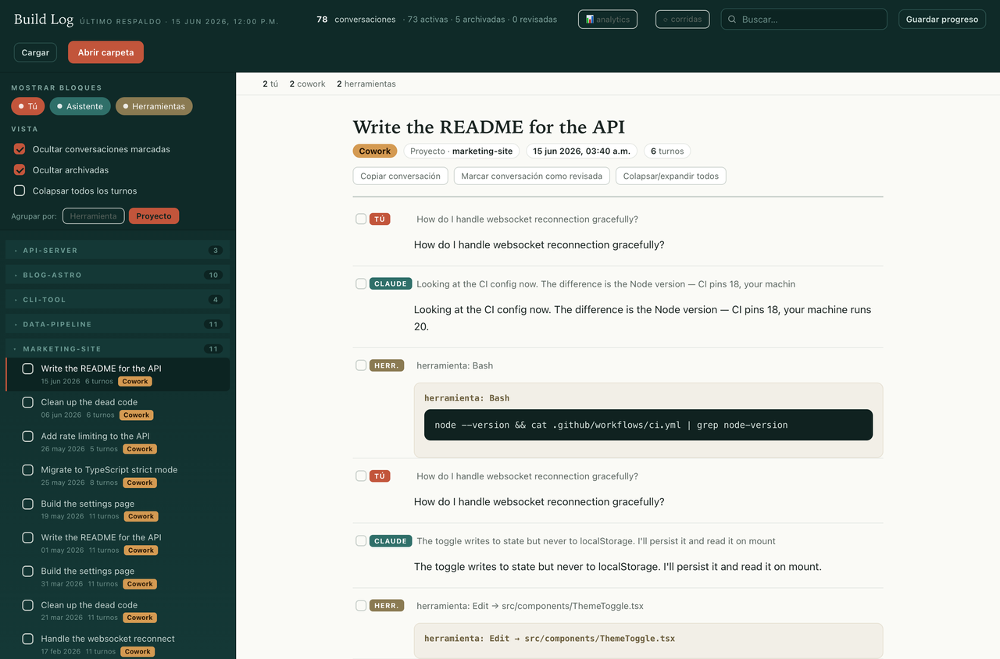
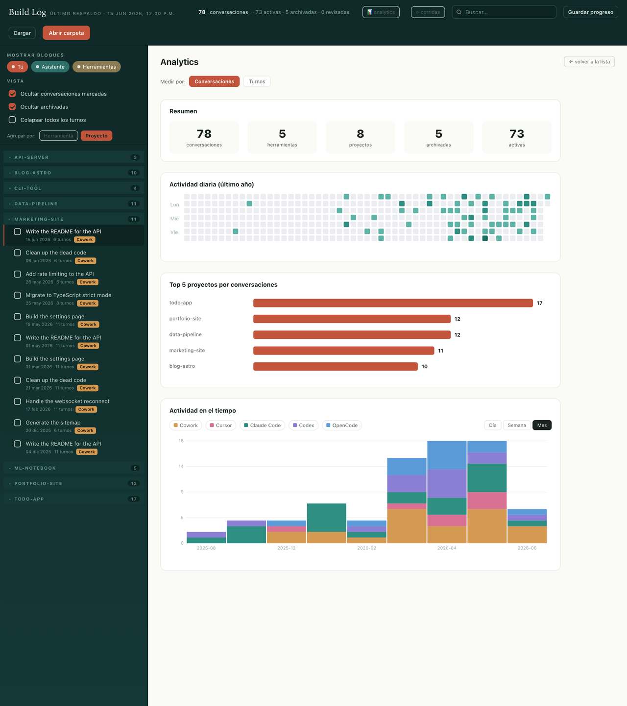
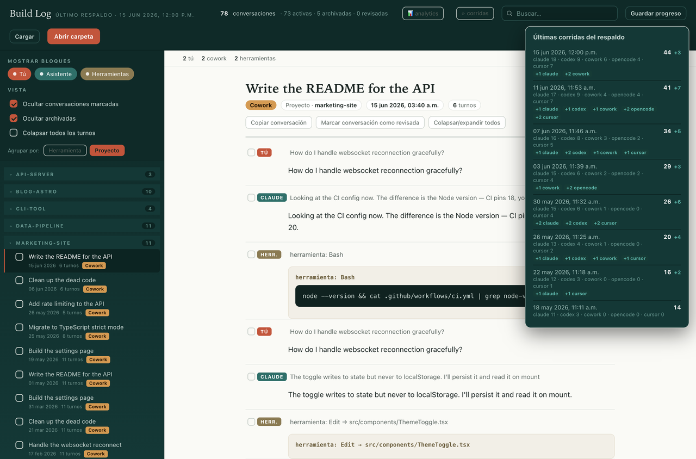

# respaldos-llms

Respaldo local + visor de tus conversaciones con herramientas de IA-coding.

Este proyecto lee dónde cada herramienta guarda sus sesiones en tu disco, las
convierte a Markdown legible con metadata estándar, y te da un visor HTML
standalone para navegarlas, agruparlas, filtrarlas y ver analíticas de tu uso.

Todo corre **localmente en tu Mac**. Nada se sube a ningún lado.

---

## Por qué

**Tus herramientas de IA no guardan tu historial para siempre — y casi nunca te
enterás cuando lo perdés.**

- **Codex** solo lista las conversaciones recientes; las viejas dejan de
  aparecer, aunque por un tiempo sigan en disco.
- **Claude Code** hace limpiezas periódicas de sesiones viejas: un día están, y
  al siguiente ya no.
- Si reinstalás una herramienta, cambiás de máquina o se corrompe una base de
  datos, ese historial se va **sin aviso**.

Esas conversaciones suelen tener **decisiones de diseño, el porqué de cómo se
hizo algo, y contexto que tu código no registra**. Este proyecto las copia a
Markdown **antes de que desaparezcan**, de forma incremental y acumulativa: una
vez respaldada, una conversación **nunca se borra de tu copia**, aunque la
herramienta de origen la elimine.

Y como son tus datos privados, **todo corre local**: los scripts solo leen tus
archivos y escriben Markdown en tu disco, el visor es un HTML estático. No hay
servidor, ni nube, ni telemetría. (Ver [Privacidad](#privacidad).)

---

## Qué hace

- **Respaldo incremental y acumulativo.** Procesa solo lo nuevo o lo que cambió
  desde la última corrida. Nunca borra markdowns ya generados, aunque la
  herramienta de origen borre la conversación original.
- **Conversión a Markdown.** Cada sesión queda como un `.md` con título, fecha,
  id, proyecto y fuente, y los turnos separados (`### Tú` / `### Claude`, etc.).
- **Visor HTML standalone** (`viewer.html`). Se abre con doble clic (`file://`),
  sin servidor. Agrupa por fuente o por proyecto, colorea por herramienta,
  filtra archivadas y revisadas, copia por turno o conversación entera, marca
  conversaciones como revisadas (progreso exportable/importable como JSON),
  muestra el historial de corridas y una vista de **analytics** (heatmap diario
  estilo GitHub, top proyectos, actividad en el tiempo por día/semana/mes con
  toggle de conversaciones/turnos).
- **Respaldo automático diario** vía `launchd` (opcional).

---

## Fuentes soportadas

| Herramienta  | Origen en disco                                                        |
|--------------|------------------------------------------------------------------------|
| Claude Code  | `~/.claude/projects/*/*.jsonl`                                          |
| Codex        | `~/.codex/sessions` y `~/.codex/archived_sessions`                      |
| Cowork       | `~/Library/Application Support/Claude/local-agent-mode-sessions`        |
| OpenCode     | `~/.local/share/opencode/opencode.db`                                   |
| Cursor       | `~/Library/Application Support/Cursor/User/globalStorage/state.vscdb`   |

### No soportadas (y por qué)

- **Antigravity** — guarda las sesiones en un formato protobuf propietario sin
  esquema público, así que no hay forma estable de parsearlas.
- **claude.ai** (la app web) — las conversaciones viven en la nube de Anthropic,
  no quedan en tu disco, por lo que no hay nada local que respaldar.

---

## Instalación

Requiere **macOS** y **Python 3** (viene con macOS).

```bash
# Dar permiso de ejecución a los scripts
chmod +x actualizar-respaldo.sh *.command
```

### Correr el respaldo a mano

```bash
./actualizar-respaldo.sh
```

Por defecto la base es la carpeta donde vive el script. Podés pasar otra ruta
como primer argumento si querés guardar los markdowns en otro lado:

```bash
./actualizar-respaldo.sh ~/mis-respaldos
```

También podés hacer **doble clic** en `actualizar-respaldo.command`.

### Activar el respaldo automático (diario, 12:00)

Doble clic en `instalar-automatico.command`. Instala una tarea de `launchd` que
corre el respaldo todos los días al mediodía (o al despertar la Mac si estaba
dormida).

Para quitarla: doble clic en `desinstalar-automatico.command`.

---

## Usar el visor

Abrí **`viewer.html`** con doble clic (se abre en el navegador como `file://`)
y apuntalo a la carpeta donde están tus `markdown-*` (la misma carpeta base del
respaldo). Desde ahí podés navegar, filtrar, copiar y ver las analíticas.

Por defecto agrupa por **proyecto**, oculta las archivadas y las ya revisadas, y
abre la conversación activa más reciente. Podés cambiar el agrupamiento (por
herramienta) y los filtros desde la barra lateral.

---

## Capturas

> Usan **datos de ejemplo generados**, no conversaciones reales.

**Lista de conversaciones** — por defecto agrupadas por proyecto, con los turnos
y los bloques de herramientas renderizados.



**Analytics** — resumen, heatmap diario del último año, top proyectos y
actividad en el tiempo (día/semana/mes, conversaciones o turnos).



**Historial de corridas** — cada respaldo queda registrado, con cuántas
conversaciones nuevas aportó cada fuente.



---

## Privacidad

- **Nada sale de tu máquina.** Los scripts solo leen archivos locales y escriben
  Markdown local; el visor es un HTML estático que abrís con `file://`. Sin
  llamadas de red, sin servidor, sin telemetría.
- **El repo NO incluye ninguna conversación.** El `.gitignore` excluye todas las
  carpetas de markdown, los datos crudos (`*.jsonl`, `*.db`, `*.vscdb`, `*.pb`) y
  el estado de sincronización. Cada quien respalda **sus propias** conversaciones
  localmente; nunca se commitea contenido real.

---

## Notas

- **macOS-only por ahora.** Usa `launchd` y rutas propias de macOS para ubicar
  los orígenes. Portarlo a Linux/Windows implicaría ajustar esas rutas y el
  mecanismo de tarea automática.

---

## Licencia

MIT — ver [LICENSE](LICENSE).
